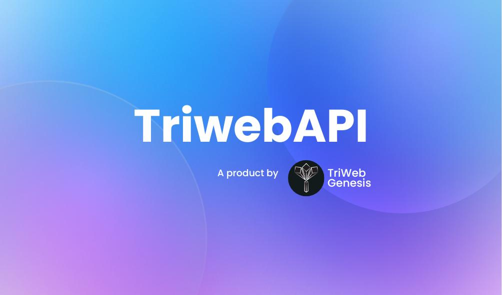

# Triweb-Learning

# Programming Concepts and Web3 Projects Repository

Welcome to my GitHub repository! This repository is a treasure trove of fundamental programming concepts and simple projects implemented using various coding languages. Whether you're a beginner looking to learn or an experienced coder seeking inspiration, you'll find a wide array of content to explore.

  

## Tools and Techs

## How to Use This Repository

Feel free to navigate through the folders and files within this repository to access the programming resources you're interested in. For beginners it could be a great experience . You can learn new concepts, explore code samples, and even dive into practical Web3 development.

## Index

 - [**HTML:**](https://github.com/aiman-syeda/Triweb-Learning/tree/main/HTML/Form)Learn how to create the basic structure of a webpage, including headings, paragraphs, lists, and links.
 - [**CSS:**](https://github.com/aiman-syeda/Triweb-Learning/tree/main/CSS)Learn how to use CSS to create stunning, visually engaging websites. Unleash your creativity to customize fonts, backgrounds, borders, and more.Apply CSS to your timetables for a polished and professional look. Customize colors, fonts, and spacing to make your schedules clear and attractive. 
 - [**JavaScript:**](https://github.com/aiman-syeda/Triweb-Learning/tree/main/JavaScript)Explore Core JavaScript Concepts.In this section, you can dive into the essential building blocks of JavaScript
 - [**Project/HTML_CSS_JS_Project:**](https://github.com/aiman-syeda/Triweb-Learning/tree/main/Project/HTML_CSS_JS_Project)This is a Simple Registration Form project in my repository! In this project, we've crafted a straightforward and user-friendly registration form using the power of HTML, CSS, and JavaScript..
 - [**My_SQL:**](https://github.com/aiman-syeda/Triweb-Learning/tree/main/My_SQL) MySQL basics and demonstrates how to perform CRUD operations, aggregate data, use GROUP BY and ORDER BY clauses, and apply UNION and JOIN operations:
 - [**Node JS:**](https://github.com/aiman-syeda/Triweb-Learning/tree/main/Node%20JS)Get started with express framework to create a simple app,You will find here simple calculator app which takes input in JSON format , performs addition,subtraction,multiplication or division as per the urls hitted and gives you the result. 
 - [**BasicProjectNodeJS:**](https://github.com/aiman-syeda/Triweb-Learning/tree/main/BasicProjectNodeJS)In this folder, you'll discover a straightforward backend of application designed to perform common user operations: creating,retrieving, updating, and deleting users. This app consists of a router file, a controller file, and an index file. It also demonstrates how to connect your data model to a PHPMyAdmin database using SQL and Sequelize. Whether you're new to Node.js or looking to understand how to integrate your application with a SQL database, this section provides a clear and practical example of how it all comes together.

